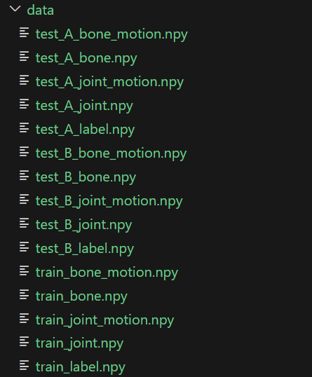

## 1. 环境配置
1. 创建conda环境，在项目根目录下运行命令
    ```bash
    conda env create -f environment.yaml #注意CUDA版本为12.1
    ```
2. 在`./Model_inference/Mix_GCN/model/Temporal_shift`目录下，运行命令
    ```bash
    chmod +x run.sh
    ./run.sh 
    ```

## 2. 数据预处理

1. 生成一个全为0的numpy数组作为测试集B的label，进入`./Process_data/`路径下，执行命令
    ```bash
    python gen_labelB.py
    ```
1. 把比赛官方给出的数据集和测试集和刚刚生成的label都放在`./Process_data/data`文件夹下，共六个文件分别为

    - `test_A_joint.npy`
    - `test_A_label_A.npy`
    - `train_joint.npy`
    - `train_label.npy`
    - `test_B_joint.npy`
    - `test_B_label.npy`
2. 生成其他模态数据

    在`./Process_data/`路径下，运行命令
    ```bash
    python gen_modal.py --modal bone --use_mp True
    python gen_modal.py --modal jmb --use_mp True
    python gen_modal.py --modal motion
    ```
    执行完命令后，data文件夹下的文件如图
    
3. 提取二维数据

    我们提取C通道的X以及Z，同时生成训练以及在b测试集验证时的`.npz`文件，在`./Process_data/`路径下，运行命令
    ```bash
    python extract_2dpose.py
    ```
5. 提取三维数据

    我们使用`joint`、`bone`、`joint_motion`和`bone_motion`进行训练和测试，在`./Process_data/`路径下，运行命令
    ```bash
    python estimate_3dpose.py --config ./configs/3d/joint3d.yaml
    python estimate_3dpose.py --config ./configs/3d/bone3d.yaml
    python estimate_3dpose.py --config ./configs/3d/jointmotion3d.yaml
    python estimate_3dpose.py --config ./configs/3d/bonemotion3d.yaml
    ```

## 3.训练

进入目录`./Model_inference/Mix_GCN/`，在该目录下运行命令

```bash
python main.py --config ./config/train/aagcn_B_3d.yaml --phase train --save-score True --device 0
python main.py --config ./config/train/aagcn_BM_3d.yaml --phase train --save-score True --device 0
python main.py --config ./config/train/aagcn_J_2d.yaml --phase train --save-score True --device 0
python main.py --config ./config/train/aagcn_J_3d.yaml --phase train --save-score True --device 0
python main.py --config ./config/train/aagcn_JM_3d.yaml --phase train --save-score True --device 0
python main.py --config ./config/train/ctrgcn_B_3d.yaml --phase train --save-score True --device 0
python main.py --config ./config/train/ctrgcn_BM_3d.yaml --phase train --save-score True --device 0
python main.py --config ./config/train/ctrgcn_J_2d.yaml --phase train --save-score True --device 0
python main.py --config ./config/train/ctrgcn_J_3d.yaml --phase train --save-score True --device 0
python main.py --config ./config/train/ctrgcn_JM_3d.yaml --phase train --save-score True --device 0
python main.py --config ./config/train/msg3d_B_3d.yaml --phase train --save-score True --device 0
python main.py --config ./config/train/msg3d_J_3d.yaml --phase train --save-score True --device 0
python main.py --config ./config/train/msg3d_JM_3d.yaml --phase train --save-score True --device 0
python main.py --config ./config/train/mstgcn_B_3d.yaml --phase train --save-score True --device 0
python main.py --config ./config/train/mstgcn_J_2d.yaml --phase train --save-score True --device 0
python main.py --config ./config/train/mstgcn_J_3d.yaml --phase train --save-score True --device 0
python main.py --config ./config/train/tdgcn_B_3d.yaml --phase train --save-score True --device 0
python main.py --config ./config/train/tdgcn_J_2d.yaml --phase train --save-score True --device 0
python main.py --config ./config/train/tdgcn_J_3d.yaml --phase train --save-score True --device 0
python main.py --config ./config/train/tegcn_B_3d.yaml --phase train --save-score True --device 0
python main.py --config ./config/train/tegcn_J_3d.yaml --phase train --save-score True --device 0
```
或直接运行脚本（不建议，因为计算量太大）
```bash
chmod +x ./script_train.sh
./script_train.sh
```
进入目录`./Model_inference/Mix_Former/`，在该目录下运行命令
```bash
python main.py --config ./config/train/mixformer_J.yaml --phase train --save-score True --device 0
python main.py --config ./config/train/mixformer_BM.yaml --phase train --save-score True --device 0
python main.py --config ./config/train/mixformer_B.yaml --phase train --save-score True --device 0
python main.py --config ./config/train/mixformer_JM.yaml --phase train --save-score True --device 0
python main.py --config ./config/train/mixformer_k2_B3d.yaml --phase train --save-score True --device 0
python main.py --config ./config/train/mixformer_k2_J3d.yaml --phase train --save-score True --device 0
```
或直接运行脚本（不建议，因为计算量太大）
```bash
chmod +x ./script_train.sh
./script_train.sh
```
## 4.测试

进入目录`./Model_inference/Mix_GCN/`，在该目录下运行命令
```bash
python main.py --config ./config/test/aagcn_B_3d.yaml --phase test --save-score True --weights ./output/aagcn_B_3d/runs-40-10240.pt --device 0 --result-path ../result/aagcn_B_3d_result.npy
python main.py --config ./config/test/aagcn_BM_3d.yaml --phase test --save-score True --weights ./output/aagcn_BM_3d/runs-36-9216.pt --device 0 --result-path ../result/aagcn_BM_3d_result.npy
python main.py --config ./config/test/aagcn_J_2d.yaml --phase test --save-score True --weights ./output/aagcn_J_2d/runs-38-9728.pt --device 0 --result-path ../result/aagcn_J_2d_reslut.npy
python main.py --config ./config/test/aagcn_J_3d.yaml --phase test --save-score True --weights ./output/aagcn_J_3d/runs-37-9472.pt --device 0 --result-path ../result/aagcn_J_3d_result.npy
python main.py --config ./config/test/aagcn_JM_3d.yaml --phase test --save-score True --weights ./output/aagcn_JM_3d/runs-37-9472.pt --device 0 --result-path ../result/aagcn_JM_3d_result.npy
python main.py --config ./config/test/ctrgcn_B_3d.yaml --phase test --save-score True --weights ./output/ctrgcn_B_3d/runs-61-15616.pt --device 0 --result-path ../result/ctrgcn_B_3d_result.npy
python main.py --config ./config/test/ctrgcn_BM_3d.yaml --phase test --save-score True --weights ./output/ctrgcn_BM_3d/runs-38-9728.pt --device 0 --result-path ../result/ctrgcn_BM_3d_reslut.npy
python main.py --config ./config/test/ctrgcn_J_2d.yaml --phase test --save-score True --weights ./output/ctrgcn_J_2d/runs-60-15360.pt --device 0 --result-path ../result/ctrgcn_J_2d_reslut.npy
python main.py --config ./config/test/ctrgcn_J_3d.yaml --phase test --save-score True --weights ./output/ctrgcn_J_3d/runs-37-9472.pt --device 0 --result-path ../result/ctrgcn_J_3d_reslut.npy
python main.py --config ./config/test/ctrgcn_JM_3d.yaml --phase test --save-score True --weights ./output/ctrgcn_JM_3d/runs-37-9472.pt --device 0 --result-path ../result/ctrgcn_JM_3d_result.npy
python main.py --config ./config/test/msg3d_B_3d.yaml --phase test --save-score True --weights ./output/msg3d_B_3d/runs-57-14592.pt --device 0 --result-path ../result/msg3d_B_3d_result.npy
python main.py --config ./config/test/msg3d_J_3d.yaml --phase test --save-score True --weights ./output/msg3d_J_3d/runs-48-12288.pt --device 0 --result-path ../result/msg3d_J_3d_result.npy
python main.py --config ./config/test/msg3d_JM_3d.yaml --phase test --save-score True --weights ./output/msg3d_JM_3d/runs-55-14080.pt --device 0 --result-path ../result/msg3d_JM_3d_result.npy
python main.py --config ./config/test/mstgcn_B_3d.yaml --phase test --save-score True --weights ./output/mstgcn_B_3d/runs-43-11008.pt --device 0 --result-path ../result/mstgcn_B_3d_result.npy
python main.py --config ./config/test/mstgcn_J_2d.yaml --phase test --save-score True --weights ./output/mstgcn_J_2d/runs-60-15360.pt --device 0 --result-path ../result/mstgcn_J_2d_result.npy
python main.py --config ./config/test/mstgcn_J_3d.yaml --phase test --save-score True --weights ./output/mstgcn_J_3d/runs-43-11008.pt --device 0 --result-path ../result/mstgcn_J_3d_result.npy
python main.py --config ./config/test/tdgcn_B_3d.yaml --phase test --save-score True --weights ./output/tdgcn_B_3d/runs-43-5504.pt --device 0 --result-path ../result/tdgcn_B_3d_result.npy
python main.py --config ./config/test/tdgcn_J_2d.yaml --phase test --save-score True --weights ./output/tdgcn_J_2d/runs-43-11008.pt --device 0 --result-path ../result/tdgcn_J_2d_result.npy
python main.py --config ./config/test/tdgcn_J_3d.yaml --phase test --save-score True --weights ./output/tdgcn_J_3d/runs-37-4736.pt --device 0 --result-path ../result/tdgcn_J_3d_result.npy
python main.py --config ./config/test/tegcn_B_3d.yaml --phase test --save-score True --weights ./output/tegcn_B_3d/runs-39-9984.pt --device 0 --result-path ../result/tegcn_B_3d_result.npy
python main.py --config ./config/test/tegcn_J_3d.yaml --phase test --save-score True --weights ./output/tegcn_J_3d/runs-39-9984.pt --device 0 --result-path ../result/tegcn_J_3d_result.npy
```
或直接运行脚本
```bash
chmod +x ./script_test.sh
./script_test.sh
```
进入目录`./Model_inference/Mix_Former/`，在该目录下运行命令
```bash
python main.py --config ./config/test/mixformer_B.yaml --phase test --save-score True --weights ./output/skmixf_B_3d/runs-55-14080.pt --device 0 --result-path ../result/mixformer_B_result.npy
python main.py --config ./config/test/mixformer_BM.yaml --phase test --save-score True --weights ./output/skmixf_BM_3d/runs-53-13568.pt --device 0 --result-path ../result/mixformer_BM_result.npy
python main.py --config ./config/test/mixformer_J.yaml --phase test --save-score True --weights ./output/skmixf_J_3d/runs-56-14336.pt --device 0 --result-path ../result/mixformer_J_result.npy
python main.py --config ./config/test/mixformer_JM.yaml --phase test --save-score True --weights ./output/skmixf_JM_3d/runs-52-13312.pt --device 0 --result-path ../result/mixformer_JM_result.npy
python main.py --config ./config/test/mixformer_k2_B3d.yaml --phase test --save-score True --weights ./output/skmixf_k2_B3d/runs-54-13824.pt --device 0 --result-path ../result/mixformer_k2_B3d.npy
python main.py --config ./config/test/mixformer_k2_J3d.yaml --phase test --save-score True --weights ./output/skmixf_k2_J3d/runs-53-13568.pt --device 0 --result-path ../result/mixformer_k2_J3d.npy
```
或直接运行脚本
```bash
chmod +x ./script_test.sh
./script_test.sh
```
我们的对B测试集的推理结果备份在`./ensemble_npy`

在`./`目录下运行如下命令
```bash
python parameter_search.p
python ensemble.py
```
最后在根目录下生成的`pred.npy`就是目标文件


