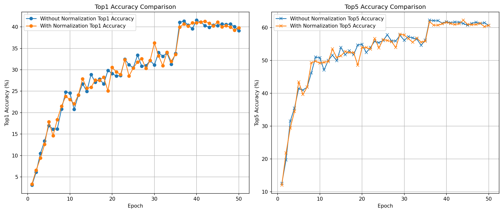
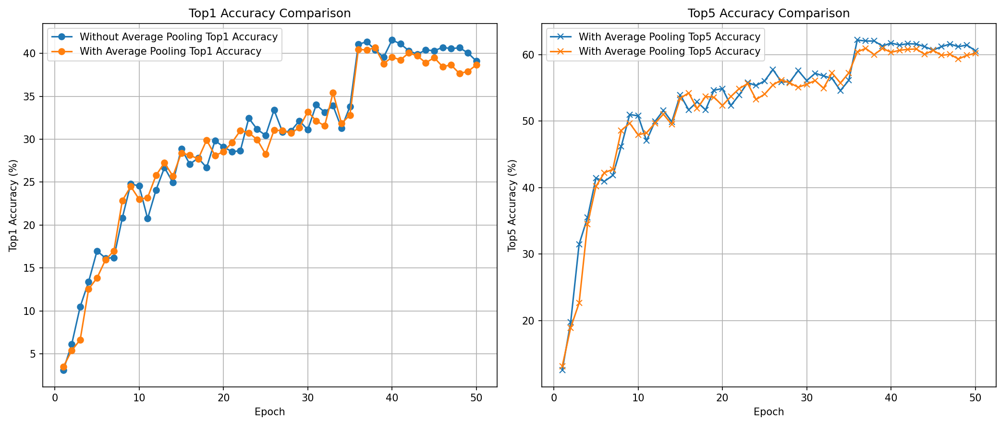

# 算法说明书

我们的工作主要基于论文：[HDBN: A Novel Hybrid Dual-branch Network for Robust Skeleton-based Action Recognition](https://ieeexplore.ieee.org/document/10645450)和他们的官方实现仓库：[https://github.com/liujf69/ICMEW2024-Track10](https://github.com/liujf69/ICMEW2024-Track10)

## 1. HDBN方法简介
HDBN方法通过结合图卷积网络（GCN）和Transformer来弥补单一网络架构的不足，充分利用两者各自的优势：GCN善于处理图结构数据，Transformer则擅长捕捉全局信息。

HDBN框架的关键点：
+ 混合双分支设计：
    + MixGCN分支：该分支使用多种类型的GCN（如TD-GCN、CTR-GCN、MST-GCN）来分别处理2D和3D骨骼数据。由于骨骼数据具有节点和连接关系的特点，GCN能很好地捕捉关节之间的空间依赖关系。
    + MixFormer分支：此分支使用基于Transformer的架构（Skeleton MixFormer）来建模骨骼数据的全局依赖，补充了GCN的空间信息，从而提升了整体的动作识别效果。
+ 四种骨骼模态：HDBN采用了四种骨骼模态：关节点（joint）、骨骼（bone）、关节点运动（joint motion）和骨骼运动（bone motion）。这些模态的结合使得模型可以更全面地捕捉人体动作的细节信息。
后期融合策略：

+ HDBN采用了后期融合策略，将两个分支的分类得分进行加权线性组合，充分整合了来自MixGCN和MixFormer分支的空间和全局信息，从而提高了最终的识别准确率。

## 2. 模型介绍
在该仓库的基础上，我们还融合一些其他模型，下面对我们所用到的模型进行简要介绍
### 2.1 Skeleton-MixFormer
论文链接：<https://dl.acm.org/doi/10.1145/3581783.3611900>

该模型解决了现有视觉Transformer在骨架数据处理中的一些瓶颈，尤其是其依赖于全通道的自注意力机制，未能有效捕捉关节通道之间的特征差异。Skeleton MixFormer包含两个主要模块：

+ 空间MixFormer：该模块采用了通道分组和混合注意力机制，动态捕捉骨架数据中的拓扑关系，通过将通道分为若干组，降低了对全通道自注意力的依赖，从而能更聚焦并解释关节之间的相邻关系。

+ 时间MixFormer：该模块包括多尺度卷积、时间Transformer和序列保持模块，通过提取时序上的关键特征，实现动作短期和长期依赖的区分，从而增强了识别精度。

该模型在多个数据集（如NTU-60、NTU-120、NW-UCLA和UAV-Human）上表现优越，超越了当前基于图卷积网络（GCN）的方法，达到最新的研究水平。

### 2.2 MSTGCN
论文链接：<https://ieeexplore.ieee.org/document/9530406>

多视图时空图卷积网络（MSTGCN）模型，旨在解决现有模型中空间-时间特征捕获难、跨个体泛化性差以及可解释性不足的问题。模型特性如下：
+ 多视图脑图：MSTGCN构建了基于功能连接和物理距离的两种脑图，以捕获不同的空间关系，增强空间特征提取能力。
+ 时空图卷积：模型结合了空间图卷积（用于脑区域连接）和时间卷积（用于睡眠阶段转换），提高了分类精度。
+ 注意力机制：引入了时空注意力机制，聚焦于最相关的信息，提升了模型的可解释性。
+ 领域泛化：模型采用了领域泛化技术，使其在不同个体间表现出较好的稳健性，无需额外微调。

MSTGCN主要针对脑电图（EEG）数据及其空间-时间图结构进行了优化，从而对睡眠阶段进行分类。数据集中人体关键点可以构建成空间图结构，类似于MSTGCN中的脑图。可以通过定义骨骼连接关系（类似于骨架图）来构建图卷积的输入。我们调整了输入特征的定义，以适应数据集的骨骼点格式，并替换原模型中的脑区域连接定义为骨架连接。

### 2.3 CTR-GCN
论文链接：<https://ieeexplore.ieee.org/document/9710007>

该模型的核心思想是通过通道级拓扑优化，使得在不同的通道上自适应地学习不同的图结构，以有效地捕捉骨架节点的特定特征，从而提高动作识别的准确性。CTR-GCN使用了一种通道级的拓扑优化机制，通过在每个通道上动态调整拓扑结构，增强模型对动作特征的捕捉能力。这种方法先学习一个通用拓扑结构作为初始，然后结合每个通道的特定特征进行细化。模型的特点如下：
+ 通道级拓扑优化：CTR-GCN通过学习一个共享的拓扑结构，并在各个通道上进行特定的优化，使得网络能够适应每个通道的特定特征。
+ 动态拓扑推理：CTR-GCN属于动态拓扑方法，其拓扑结构会根据输入样本进行动态调整，具备更强的泛化能力。
+ 强大的表达能力：通过数学分析和实验，CTR-GCN展示出比传统图卷积更强的特征表达能力，在各类复杂动作尤其是涉及手部微动作的分类中表现优异。

CTR-GCN通过创新的通道级拓扑优化方法，显著提升了骨架动作识别的性能和模型的灵活性，成为该领域的新颖方法。

### 2.4 2s-AGCN
论文链接：<https://ieeexplore.ieee.org/abstract/document/8953648>

该模型主要解决了图卷积网络（GCN）在骨骼数据上使用的图结构固定、未充分利用骨骼间连接信息的问题。2s-AGCN 采用了自适应图卷积网络（AGCN），通过引入三种图结构：
+ 全局图（Global Graph）：表示对所有数据样本通用的骨骼连接模式，适用于广义的身体结构。
+ 可学习图（Learnable Graph）：该图在训练过程中被学习并优化，允许模型为特定层次学习数据驱动的连接关系，以更好地适应特定层的特征需求。
+ 数据依赖图（Data-Dependent Graph）：通过样本的自适应调整，为每个样本动态生成独特的图结构，表示个体化的样本特征。

在实现上，AGCN 的每层包含这三种图，分别通过不同的权重矩阵组合来决定各节点间的连接关系。相比固定拓扑结构，该方法允许图结构在训练过程中自动调整，从而提高了模型在不同动作类别下的灵活性和表达力。

除了节点的位置信息（第一阶信息），2s-AGCN 引入了骨骼的第二阶信息，即关节点之间的骨长和方向信息。双流结构通过两条独立分支来分别处理这两类信息：
+ 第一阶信息流（Joints Stream, J-stream）：处理关节点的三维坐标信息，用于识别动作的空间布局。
+ 第二阶信息流（Bones Stream, B-stream）：处理骨长和方向向量，用于捕捉骨骼之间的相对位置和方向变化。

双流结构将两条流的输出通过 softmax 进行融合，最终预测动作类别。实验结果表明，融合后的双流结构相比单流结构（仅使用关节点或骨骼信息）能够显著提高动作识别准确率。

### 2.5 MS-G3D
论文链接：<https://arxiv.org/abs/2003.14111>

一种新的多尺度骨架图卷积模型（MS-G3D），用于改进基于骨架的人体动作识别任务。以下是该模型的主要特色：

+ 多尺度解耦聚合方案：论文提出了一种解耦多尺度聚合方法，通过区分不同邻域节点的特征重要性来解决长距离建模的偏置问题。这种解耦式聚合能够避免较近节点的特征对较远节点的干扰，使得模型可以更有效地捕获跨节点的长距离关系，增强了对人体骨架全局结构的理解。

+ 统一的空间-时间图卷积（G3D）操作：该论文提出的G3D模块通过在空间-时间图上引入跳跃连接，使得空间和时间的跨节点信息能够直接流动，提升了复杂的空间-时间依赖建模能力。G3D能够直接在三维空间-时间图上操作，通过引入跨帧的边来促进信息传播，从而捕捉到复杂的动作特征。

+ MS-G3D模块：结合解耦聚合方案和G3D操作构建的MS-G3D模块在空间和时间维度上同时具备多尺度感受野。这种模块能够从多尺度的空间-时间域中提取丰富的特征，使模型在大规模数据集上表现优异。

+ 骨架图连接的改进：MS-G3D模型进一步增强了图卷积网络（GNN）的结构，通过调整骨架图中的连接方式，使得跨时间的邻接关系更加稠密，以便信息能在多帧之间流动。此外，引入了残差图掩码（residual mask），提升了模型对不同节点关系的灵活性，增强了骨架特征的建模能力。

### 2.6 TE-GCN
论文链接：<https://arxiv.org/abs/2012.08804>

论文提出了一种时间增强图卷积网络（Temporal Enhanced Graph Convolutional Network, TE-GCN），以改进基于骨架的动作识别。骨架动作识别在计算机视觉中至关重要，广泛应用于监控、人机交互等领域。传统方法通过堆叠多个局部卷积来捕捉时间关系，但这种方法容易导致重要的非相邻时间信息被稀释。TE-GCN针对这一局限，通过显式捕获短期和长期的时间依赖关系来改进模型表现。模型特色如下：
+ 时间关系图：TE-GCN 引入了时间关系图，通过建立相邻和非相邻帧之间的连接，捕捉时间上相关的帧之间的关系。这种方法使得模型能够捕捉到动作序列中关键时刻的长期依赖关系。

+ 多头机制：通过多头机制，TE-GCN 可以探索不同类型的时间关系。这个方法丰富了模型的时间模式学习能力，有助于提取更具辨别力的特征。

+ 多流多模态网络：模型包含多个流来处理不同模态的信息，如关节、骨骼及其运动信息，每个模态提供互补数据。这些模态的融合在复杂的动作识别任务中显著提升了模型性能。

+ 残差结构：每个时间增强图卷积层采用残差连接方式，能够将 TE-GCN 集成到现有模型的不同层中，而不会破坏原有模型的功能。

### 2.7 TDGCN
论文链接：<https://ieeexplore.ieee.org/document/9951516>

TDGCN模型整合了两个主要组件：

+ 时序卷积层：利用门控线性单元（GLU）来提取时间特征，从而实现高效的并行计算。
+ 空间图卷积层：采用了一种新颖的dropout图技术来处理网络数据的空间结构，通过节点和边的dropout操作，避免了过拟合和过度平滑的问题。
为了在不降低训练效率的情况下加深模型结构，作者提出了深度批量归一化（DBN）方法，确保各层之间的激活值分布稳定。

模型特色如下：
+ Dropout图卷积：引入随机节点和边的dropout操作，通过对输入图的随机扰动有效地防止了过拟合。
+ 深度批量归一化：这种归一化方法通过对滤波器施加零均值和单位方差约束来稳定训练，支持更深层的网络结构。

## 3. 融合策略简介
HDBN采用了后期融合（Late Fusion）策略，将MixGCN分支和MixFormer分支的分类结果进行融合，以提升整体的动作识别准确性。后期融合策略的具体实现方法如下：

1. 分支得分计算：

    在 HDBN 中，分别使用 MixGCN 分支和 MixFormer 分支来处理骨骼数据。这两个分支独立处理骨骼数据，各自输出一组分类得分：
    - MixGCN 分支 负责处理骨骼数据中的图结构关系，输出一组基于图卷积的分类得分，记为 $M_{\text{gcn}}(P)$。
    - MixFormer 分支 利用 Transformer 来建模骨骼数据的全局信息，输出一组基于 Transformer 的分类得分，记为 $M_{\text{former}}(P)$。

2. 线性组合：
   - 将两个分支的得分以线性方式进行组合，得到最终的融合分类结果。具体的融合公式为：
     $$
     S = \alpha \cdot M_{\text{gcn}}(P) + \beta \cdot M_{\text{former}}(P)
     $$
   - 其中，$\alpha$ 和 $\beta$ 是可调的权重参数，用来控制两个分支的贡献度。通过调整这两个参数的值，可以优化融合后的分类结果，使得不同分支的特征在最终分类时得到合理的权衡。
   - $M_{\text{gcn}}(P)$ 和 $M_{\text{former}}(P)$ 分别表示两个分支在给定输入 $P$ 上的分类得分。

3. Softmax 处理：
   - 在融合后，应用 Softmax 激活函数对得分 $S$ 进行归一化，以便生成概率分布，从而得到最终的分类结果。这个概率分布可以用于确定动作类别的预测结果。
   - Softmax 处理公式如下：
     $$
     \text{Output} = \text{Softmax}(S)
     $$
   - 这种处理确保了不同动作/类别之间的得分分布，使得分类器能够更准确地选择最终的预测类别。
## 4. 数据预处理
### 4.1 四种骨骼模态
根据关节点（joint）处理出四种骨骼模态：关节点（joint）、骨骼（bone）、关节点运动（joint motion）和骨骼运动（bone motion），这个官方已经给出实现。通过四种骨骼模态，可以让模型更全面地捕捉人体动作的细节信息。

### 4.2 提取出2D骨骼点
由于数据集的3d骨骼点是从2d骨骼点估计得来的，我们还原到2d骨骼点，有利于减少估计误差，增加模型准确度，具体的实现方法是提取C通道的x和z。

### 4.3 对数据集作均值归一化处理
均值归一化：使用均值和标准差对数据集进行归一化处理，公式如下：

$$x^{\prime}=\frac{x-\mu}\sigma $$

其中$x$为原始数据，$\mu$为均值，$\sigma$为标准差。

以MSTGCN网络的joint模态为例，均值归一化前后对Top1准确率和Top5准确率的对比如图  

由图可知，对数据集作均值归一化处理对准确率没有大幅度改善。

### 4.4 对数据集作平滑处理
我们使用简单的移动平滑对数据集进行处理，以求减少数据集的噪声，移动平均平滑的目标是对时间序列中的每个数据点，计算其前后一定数量点的平均值。移动平均的公
式如下：
对于一个时间序列$x(t)$,使用窗口大小为$w$的移动平均可以表示为：
$$y(t)=\frac1w\sum_{i=-k}^kx(t+i)$$

其中：

+ $y(t)$表示平滑后的时间点$t$的值。
+ $x(t)$表示原始数据在时间点$t$的值。
+ $w$是滑动窗口的大小，通常设为奇数，以便当前时间点处于窗口的中心位置。
+ $k=\frac{w-1}2$表示窗口大小的一半，即左右各有$k$个点。

以MSTGCN网络的joint模态为例，移动前后对Top1准确率和Top5准确率的对比如图  

由结果可知，移动平滑不仅没有提高模型的准确率，反而降低了模型的精度，可能原因是
+ 平滑过度：移动平滑通过对时间维度进行平滑，减少了数据中的高频变化和噪声。然而，某些关键的高频特征（例如，快速的动作变化、动作的起伏等）可能在平滑过程中被削弱甚至丢失。
+ 关键动作的丢失：例如在 UAV-Human 数据集中，某些快速的动作或姿态变化可能被平滑处理掉，而这些变化对于识别和分类是非常重要的。

因此后面我们没有采用这种方式处理数据

### 4.5 数据集增广
